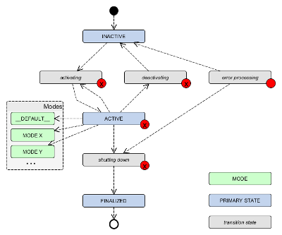

# ROS 2 System Modes

The system modes concept assumes that a robotics system is built from components with a lifecycle. It adds a notion of (sub-)systems, hiararchically grouping these nodes, as well as a notion of *modes* that determine the configuration of these nodes and (sub-)systems in terms of their parameter values.

A list of (current and future) requirements for system modes can be found here: [requirements](./doc/requirements.md#system-runtime-configuration).

General information about this repository, including legal information, project context, build instructions and known issues/limitations, are given in [README.md](../README.md) in the repository root.

## System Modes Package

The system modes concept is implemented as a package for ROS 2. This package provides a library for system mode inference, a mode manager, and a mode monitor.

### System Modes Library

The library consists of the parser of the system modes model and the mode inference mechanism.

#### Hierarchal System Modeling

We assume the system to comprise of loosely-coupled - potentially distributed - components with a runtime lifecycle; hereinafter referred to as '*nodes*'. We call semantic grouping of these nodes a *(sub-)system*. We assume that these (sub-)systems can again be hierarchically grouped into further (sub-)systems, see [system-of-systems](https://en.wikipedia.org/wiki/System_of_systems). All nodes and (sub-)systems that belong to a certain (sub-)system are referred to as *parts* of this (sub-)system.

The introduced notion of (sub-)systems does not refer to a concrete software entity, but rather a *virtual* abstraction that allows efficient and consistent handling of node groups.

*Note:* In a first stage of this concept, we assume that the entire system can be specified up-front. Later revisions of this concept might have to take care of changing systems, i.e. further nodes and/or (sub-)systems joining at runtime.

#### Lifecycle

Within this package, we assume that nodes are [ROS 2 Lifecycle Nodes](http://design.ros2.org/articles/node_lifecycle.html). We extend the ROS 2 default lifecycle by the following aspects:

1. We introduce **modes** that are specializations of the *ACTIVE* state, see [System Modes](#system-modes).
2. We introduce an optional transition from *ACTIVE* to *activating* to allow changing modes without deactivating the node.



We additionally establish the same lifecycle for the (sub-)systems introduced [above](#hierarchical-system-modeling). Hence, all *parts* of a system can be assumed to have the same lifecycle.

#### System Modes

System modes extend the *ACTIVE* state of the ROS 2 lifecycle and allow to specify different configurations of nodes and (sub-)systems:

* **Modes of nodes** consist of parameter values.
* **Modes of (sub-)system)** consist of modes of their *parts*.

For example, a node representing an actuator might provide different modes that specify certain maximum speed or maximum torque values. An actuation sub-system, grouping several actuator nodes, might provide modes that activate/deactivate certain contained actuator nodes and/or change their modes based on its own modes.

Both, the [system hierarchy](#hierarchical-system-modeling) as well as the system modes are specified in a system modes and hierarchy model file (SHM file, yaml format) that can be parsed by the [mode inference](#mode-inference) mechanism. The SMH file adheres to the following format *(curly brackets indicate placeholders, square brackets indicate optional parts, ellipses indicate repeatability)*:

```yaml
{system}:
  ros__parameters:
    type: system
    parts:
      {node}
      […]
    modes:
      __DEFAULT__:
        {node}: {state}[.{MODE}]
        […]
      {MODE}:
        {node}: {state}[.{MODE}]
        […]
      […]
[…]

{node}:
  ros__parameters:
    type: node
    modes:
      __DEFAULT__:
        ros__parameters:
          {parameter}: {value}
          […]
      {MODE}:
        ros__parameters:
          {parameter}: {value}
          […]
      […]
[…]
```

The [system_modes_examples](../system_modes_examples/) package shows a simple example consisting of modes for one system and two nodes. The model file of the example can be found [here](../system_modes_examples/example_modes.yaml).

#### Mode Inference

Since the introduced (sub-)systems are not concrete software entities, their state and mode has to be *inferred* from the states and modes of their parts. This inference mechanism is part of the system modes library and is used by the [mode manager](#mode_manager) and [mode monitor](#mode_monitor) that are also included in this package. We can show that system states and modes can be deterministically inferred under the following conditions:

1. Nodes can be asked for their state, mode, and parameters
  This is true, since the lifecycle nodes provide the according lifecycle state service (GetState) and the [mode manager](#mode_manager) provides the according mode service (GetMode).
1. *Target* states and modes are known
  Before attempting a state or mode change for a system or node, the [mode manager](#mode_manager) publishes information about the request.
  The according topics might need to be *latched* in order to allow nodes to do the inference after joining a running system.

### Mode Manager

The mode manager is a ROS node that accepts an SHM file (see [above](#system-modes)) as command line parameter. It parses the SHM file and creates the according services, publishers, and subscribers to manage the system and its modes.

* For (sub-)systems, it mirrors the lifecycle services that are available for ROS 2 lifecycle nodes, i.e.
  * `/{system}/get_available_states` - lifecycle_msgs/GetAvailableStates
  * `/{system}/get_state` - lifecycle_msgs/GetState
  * `/{system}/change_state` - lifecycle_msgs/ChangeState
* For (sub-)systems *and* nodes, it provides similar services for modes, i.e.
  * `/{system_or_node}/get_available_modes` - [system_modes/GetAvailableModes](./srv/GetAvailableModes.srv)
  * `/{system_or_node}/get_mode` - [system_modes/GetMode](./srv/GetMode.srv)
  * `/{system_or_node}/change_mode` - [system_modes/ChangeMode](./srv/ChangeMode.srv)
* Service calls to these services publish information on the requested state change or mode change before attempting them. These are published on the following topics:
  * `/{system_or_node}/transition_request_info` - lifecycle_msgs/TransitionEvent
  * `/{system_or_node}/mode_request_info` - [system_modes/ModeEvent](./msg/ModeEvent.msg)

Running the manager:
$ `ros2 launch system_modes mode_manager.launch.py modelfile:=[path/to/modelfile.yaml]`

### Mode Monitor

The mode monitor is a ROS node that accepts an SHM file (see [above](#system-modes)) as command line parameter. It continuously monitors and displays the entire system state and mode based on the mode inference introduced [above](#mode-inference). It monitors the following topics:

* `/{system_or_node}/transition_request_info` for all known (sub-)systems and nodes from the model file to monitor their target states
* `/{system_or_node}/mode_request_info` for all known (sub-)systems and nodes from the model file to monitor their target modes
* `/parameter_events` to infer the current modes for all known nodes based on their parameter values


Running the monitor:
$ `ros2 launch system_modes mode_monitor.launch.py modelfile:=[path/to/modelfile.yaml]`

### Error Handling and Rules (Experimental)

If the _actual_ state/mode of the system or any of its parts diverges from the _target_ state/mode, we define rules that try to bring the system back to a valid _target_ state/mode, e.g., a degraded mode. Rules work in a bottom-up manner, i.e. starting from correcting nodes before sub-systems before systems. Rules are basically defined in the following way:

```pseudo
if:
 system.target == {target state/mode} && system.actual != {target state/mode} && part.actual == {specific state/mode}
then:
 system.target := {specific state/mode}
```

if _actual_ state/mode and _target_ state/mode diverge, but there is no rule for this exact situation, the bottom-up rules will just try to return the system/part to its _target_ state/mode.
*Potentiall dangereous, to be discussed:* what's happening, if the system is already on its way. E.g., a system or part was just commanded to transition to _ACTIVE.foo_, but is currently _activating_ (so doing everything right). In this case we have to avoid that the bottom-up rules will trigger.

*Note:* This feature is still experimental and might be subject to major changes. However, if no rules are specified in the model file, this feature is not used.

## How to Apply

When designing the hierarchy of your system, try to group parts semantically, e.g., everything that belongs to *perception* or *navigation*. You want to group those parts of a system that are often jointly managed (initialized, shutdown, configured). Hierarchies don't necessarily need to be designed in one big tree, but can form several parallel trees.

When designing system modes for your system, try to focus on platform-specific aspects (so those that are generally present) rather than aspects specific to a certain application. Good examples are *degraded* and *performance* modes of the platform, bad examples are system modes to encode the current number of (grasping) re-tries.

Also, do not model any "read-only" system modes, e.g., modes that discretize/encode a read-only internal state. An example for such a mode specification to avoid is *low energy* and *full*, discretizing the charging level of a battery component. The System Modes concept assumes that the activatability of a system mode of a given node or subsystem should depend only on the states and modes of the other nodes and subsystems (and on the higher-level task executed by some deliberation layer). Note that the same applies to the ROS 2 node lifecycle states (*Unconfigured*, *Inactive*, etc.). The only exception is the *ErrorProcessing* state, which can be entered autonomously by the node itself. Within the mode inference, if a node performs a transition to *ErrorProcessing*, this is automatically propagated upwards as inferred state along the hierarchy. It is up to the deliberation layer to handle the failure of this node or subsystem.
