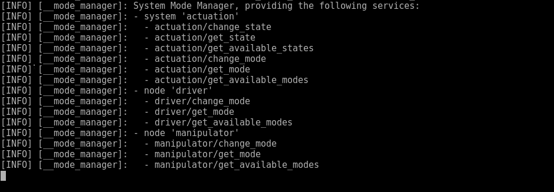
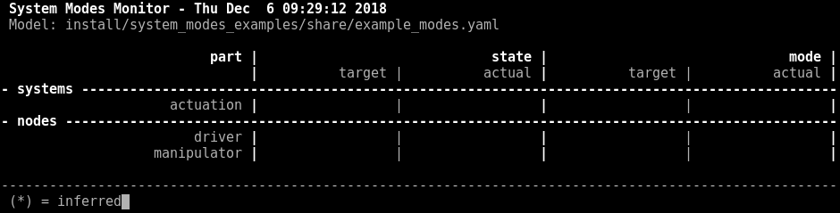
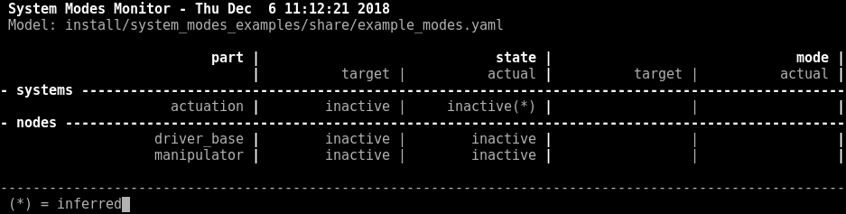
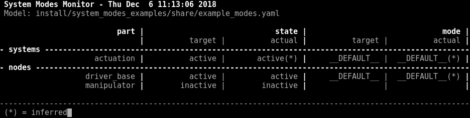
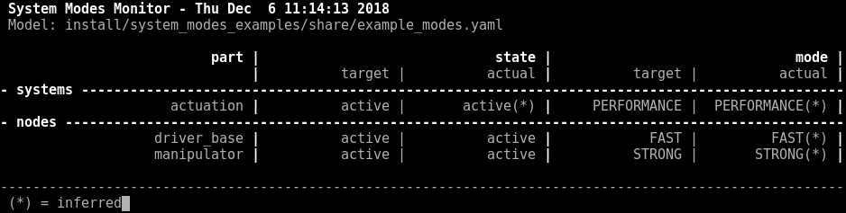
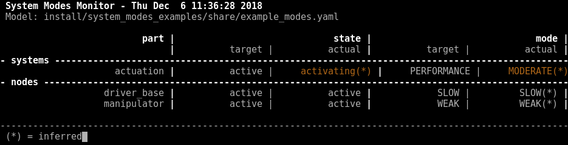

General information about this repository, including legal information, build instructions and known issues/limitations, can be found in the [README](../README.md) of the repository root.

# The system_modes_examples package

This [ROS 2](https://index.ros.org/doc/ros2/) package provides a simple example for the use of the [system_modes](../system_modes/) package. It contains two ROS 2 LifecycleNodes, a *drive\_base* node and a *manipulator* node, as well as simple a model file (yaml).

## Example Model File

The SMH file [example_modes.yaml](./example_modes.yaml) specifies an *actuation* system consisting of the *drive\_base* node and the *manipulator* node, system modes for the *actuation* system, as well as system modes for the two nodes:

* The *manipulator* node has a default mode, a *STRONG* mode, and a *WEAK* mode, configuring different values for its *max_torque*.
* The *drive\_base* node has a default mode, a *FAST* mode, and a *SLOW* mode, configuring different values for its *max_speed* and its controller (*PID* or *MPC*).
* The *actuation* system comprises of these two nodes. It has a default mode, a *PERFORMANCE* mode, and a *MODERATE* mode, changing the modes of its two nodes accordingly.

## Running the Example

### Setup

Until this package provies a proper launch configruation, open 3 terminals to set up your example system:

1. terminal 1: start the *drive\_base* node:  
  $ `ros2 launch system_modes_examples drive_base.launch.py`  
1. terminal 2: start the *manipulator* node:  
  $ `ros2 launch system_modes_examples manipulator.launch.py`  
1. terminal 3: start the [mode_manager](../system_modes/README.md#mode_manager) with the provided example model file:  
  $ `ros2 launch system_modes mode_manager.launch.py modelfile:=[path/to]/example_modes.yaml` (If you installed the binary package directly, the example model file is located in `/opt/ros/[distribution]/share/system_modes_examples/`. If you built the package from source, the file is typically located in `install/system_modes_examples/share/system_modes_examples/`.)
  The mode manager parses the provided SHM model file and creates the necessary services and topics to manage the system modes of the two nodes as well as services and topics to manage the system modes *and* the lifecycle of the *actuation* system.
  

In an additional fourth terminal, start the [mode_monitor](../system_modes/README.md#mode_monitor) to see the system modes inference in action:  

* $ `ros2 launch system_modes mode_monitor.launch.py modelfile:=[path/to]/example_modes.yaml`  

The monitor updates every second and displays the current lifecycle states and modes of the example system.

Now that you set up the system and you are able to monitor it, play around with it.

### Change System States and System Modes

In an additional fifth terminal, you may mimic a planning/executive component to change the state and mode of your system or its components.

1. Start by initializing your system to inactive. The ROS 2 command  
  $ `ros2 service call /actuation/change_state lifecycle_msgs/ChangeState "{transition: {id: 1, label: configure}}"`  
  will call the according service on the mode manager, which will change the state of the two nodes to *inactive* accordingly. Observe the console output of the mode manager and the two nodes as well as the mode monitor. The mode monitor should display the following system state:  
    
1. Activate your system with the following ROS 2 command:  
  $ `ros2 service call /actuation/change_state lifecycle_msgs/ChangeState "{transition: {id: 3, label: activate}}"`  
  To change the *actuation* system into active and its default mode (since no explicit mode was requested), the mode manager will set the *drive\_base* to active and leave the *manipulator* inactive, as specified in the model file.
  The mode monitor should display the following system state:  
    
1. Set your system into *PERFORMANCE* mode with the following ROS 2 command:  
  $ `ros2 service call /actuation/change_mode system_modes/ChangeMode "{node_name: 'actuation', mode_name: 'PERFORMANCE'}"`  
  To change the *actuation* system into its *PERFORMANCE* mode, the mode manager will change the *drive\_base* to *FAST* mode and activate the *manipulator* node in its *STRONG* mode.
  The mode monitor should display the following system state:  
  
  Note, that the system state and mode as well as the node modes are indicated to be *inferred*, as explained in the [mode inference](../system_modes/README.md#mode-inference) section of the [system_modes](../system_modes/) package.
1. You can further play around with the mode inference. For example, change the mode of the two nodes explicitly so that the target mode and actual mode of the *actuation* system diverge. Execute the following two ROS 2 commands:  
  $ `ros2 service call /drive_base/change_mode system_modes/ChangeMode "{node_name: 'drive_base', mode_name: 'SLOW'}"`  
  and  
  $ `ros2 service call /manipulator/change_mode system_modes/ChangeMode "{node_name: 'manipulator', mode_name: 'WEAK'}"`  
  The mode monitor should display the following system state:
  
  Note, that the mode monitor is able to infer that the system's *actual* mode is now *MODERATE*. This is based on the fact that both its nodes are active, the *drive\_base* is in its *SLOW* mode, and the manipulator is in its *WEAK* mode. However, the last requested mode for the *actuation* system is *PERFORMANCE*, so the monitor infers that the system is still transitioning into its target mode, indicating that the actual system state is *activating* (see [lifecycle](../system_modes/README.md#lifecycle)).
